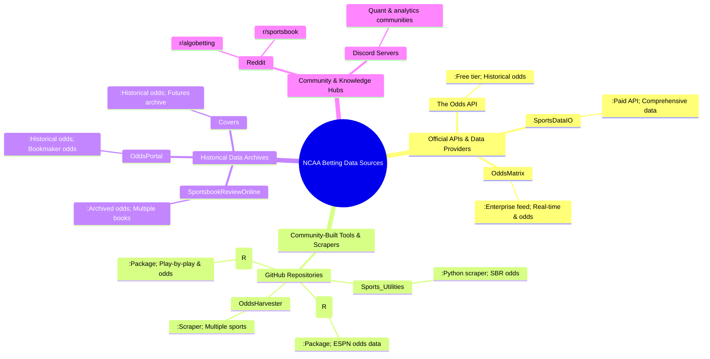

Excellent question. Building a robust historical betting model requires diving into the data ecosystems that serious analysts use. Based on the search results and common knowledge in the community, here is a comprehensive breakdown of sources for NCAA basketball betting odds (2018-2025), categorized by type and annotated with access methods.

### 📊 Official APIs & Data Providers

These are commercial services that provide structured, reliable data, often with free tiers for limited use.

| Source | Data Coverage | Access Method & Notes |
| :--- | :--- | :--- |
| **The Odds API** 【turn0search3】【turn0search15】 | Live & upcoming NCAAB odds. Historical data may be available upon request or via specific endpoints. | **Free tier** with limited requests. Paid plans for higher volume. A popular starting point for developers. |
| **SportsDataIO** 【turn0search16】 | Comprehensive NCAA Basketball API including scores, odds, projections, stats, and news. | **Paid API** with developer documentation. A standard choice for professional-grade applications. |
| **OddsMatrix** 【turn0search17】 | Dynamic odds feed for pre-game and live NCAA basketball markets, including player props. | **Enterprise data feed**. Typically used by sportsbooks and large-scale analytics firms. |
| **TxODDS** 【turn0search18】 | Sports betting data and odds API, with coverage for basketball and in-play data. | **Commercial API**. Offers specialized data and insights for scouting and analysis. |

### 🛠️ Community-Built Tools & Scrapers

The most valuable resources are often created by the community itself. These repositories contain code for scraping and processing odds data.

| Tool / Repository | Primary Function | Access & Status |
| :--- | :--- | :--- |
| **OddsHarvester** (GitHub) 【turn0search6】 | A Python application designed to **scrape historical and live sports odds**. Supports multiple sports, including NCAAB. | **Actively maintained**. A powerful open-source tool for building your own dataset. Requires setup. |
| **Sports_Utilities** (GitHub) 【turn0search5】 | Python scripts for NCAA basketball analysis. Notably, `dailyOddsNCAA.py` pulls daily odds from **SportsbookReview.com**. | **Working scraper**. Demonstrates a direct method to collect odds data from a major aggregator site. |
| **collegehoops** (R Package) 【turn0search8】 | An R package for gathering men's NCAA basketball data, including **betting odds from ESPN**. | **Functional package**. Provides a programmatic way to get ESPN's odds data within R. |
| **ncaahoopR** (R Package) 【turn0search9】 | Another major R package for NCAA basketball data, focused on play-by-play data, but also includes functions for game data and odds. | **Well-regarded package**. A cornerstone of the R-based sports analytics community. |
| **kenpom-client** (GitHub) 【turn0search7】 | A Python MCP server and API client for KenPom basketball data. It can scrape NCAA Basketball odds from `overtime.ag`. | **Niche tool**. Shows how to scrape odds from a specific sportsbook for integration with advanced metrics. |

### 📁 Historical Data Archives & Aggregators

These sites host historical odds data that can be manually downloaded or scraped.

| Archive | Data Available | How to Access |
| :--- | :--- | :--- |
| **SportsbookReviewOnline** 【turn0search19】 | **Historical NCAA Basketball Scores and Odds Archives**. Contains opening/closing lines and totals from multiple sportsbooks. | **Direct web archive**. Likely the most straightforward source for historical CSV/HTML data. Use `wget` or a web scraper. |
| **OddsPortal** 【turn0search22】 | Provides a full breakdown of historical betting odds for each bookmaker for every market. | **Browsable website**. Data is presented in HTML; requires scraping or manual collection. |
| **Covers** 【turn0search21】 | "Sports Odds History" section includes historical betting odds and futures archives. | **Browsable history**. Another potential source for scraped historical data. |
| **Odds Shark Database** 【turn0search1】 | A free tool to create custom betting reports with actionable stats and trends. | **Interactive web tool**. Good for trend analysis, but may not be ideal for bulk data export. |

### 💬 Community Hubs & Discussion Platforms

Where analysts discuss data sources, share code, and trade tips.

| Community | Focus | Relevant Discussion |
| :--- | :--- | :--- |
| **r/algobetting** (Reddit) 【turn0search10】【turn0search11】 | A place for redditors to discuss sports modeling, statistical methods, programming, and automated betting. | **Highly relevant**. This is a key community for quant/data-engineering discussions. Ask about data sources here. |
| **r/sportsbook** (Reddit) 【turn0search12】 | Reddit's March Madness sports betting discussion forum. | More general betting talk, but useful for understanding market behavior and informal data sharing. |
| **Sports Betting Discord Servers** 【turn0search14】 | Various Discord servers exist for sports betting analytics, often with dedicated channels for data and modeling. | **Actively used**. These are where real-time data sharing and collaborative scraping projects are discussed. |

### 🔍 How to Approach Your Data Collection

Given your goal of a comprehensive model, a multi-pronged strategy is recommended:

1. **Start with Archives**: For historical data (2018-2025), begin by scraping or manually downloading from **SportsbookReviewOnline** 【turn0search19】 and **OddsPortal** 【turn0search22】. These are likely your most complete free sources for multi-book odds.
2. **Use Community Scrapers**: For more recent or ongoing data, utilize tools like **OddsHarvester** 【turn0search6】 or the scripts in **Sports_Utilities** 【turn0search5】. These are built by practitioners and are known to work.
3. **Supplement with APIs**: For consistency and to fill gaps, consider a paid API like **SportsDataIO** 【turn0search16】 or use the free tier of **The Odds API** 【turn0search3】 for current-season data.
4. **Engage the Community**: Join **r/algobetting** 【turn0search10】 and relevant Discord servers 【turn0search14】. Ask specifically about datasets for the 2018-2025 period. Community members often share or trade scraped datasets.

📖 Deep Dive: Accessing & Using Key Sources

* **Scraping SportsbookReviewOnline**: The `dailyOddsNCAA.py` script 【turn0search5】 provides a template. You can adapt its logic to pull historical data by iterating through past dates. The site's structure is a common target for scrapers.
* **Using OddsHarvester**: This Python tool 【turn0search6】 is designed for this exact purpose. You would configure it to target NCAA basketball and specify the date range. It may handle multiple sportsbooks automatically.
* **Leveraging R Packages**: If you use R, the `collegehoops` 【turn0search8】 and `ncaahoopR` 【turn0search9】 packages can programmatically fetch ESPN's odds data for thousands of games, which is an excellent cross-reference source.

### ⚠️ Important Considerations

* **Data Consistency**: Opening and closing lines can vary slightly between data sources due to different recording times. Always document your source.
* **Deprecation**: Some scrapers may break if websites change their layout. The **OddsHarvester** repository 【turn0search6】 with its community of forks is a good place to check for updates.
* **Legal & Ethical Scraping**: Always check a website's `robots.txt` and terms of service before scraping. Use delays between requests to avoid overloading servers.

By combining archived data, active scraping tools, and community knowledge, you can assemble the comprehensive dataset needed for your historical model. The true depth of resources often lies in these community-developed tools and discussions rather than in top-level search results.
